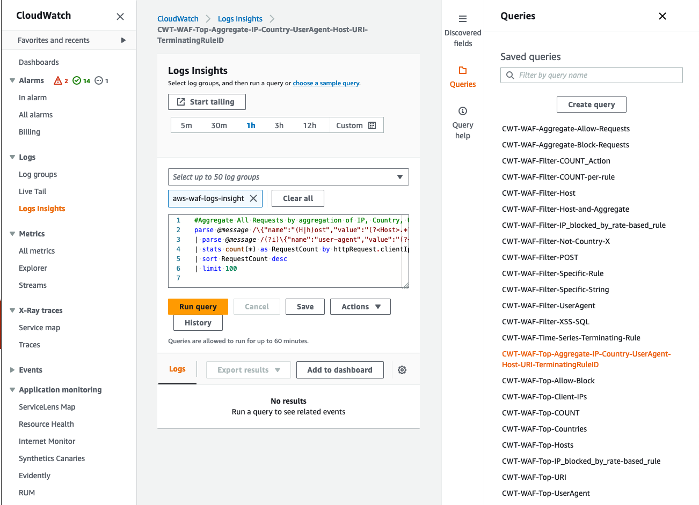

## Description

This is an AWS CloudFormation template creating the common CloudWatch Logs Insights queries to analyze AWS WAF logs.

## Deploying the CloudFormation template

1. Sign in to the AWS CloudFormation console in the correct AWS region
2. Create a new CloudFormation stack (with new resources)
3. Choose "Template is ready" and upload the JSON file `cwt-query-samples-cloudformation-template.json`
4. At Step 2, input your stack name and specify your CloudWatch Log Group name containing AWS WAF access logs
5. Complete the following steps with default settings

## Testing the template

Enter the AWS CloudWatch Log Insights console, click the "Queries" icon on the right, then you will see the query samples created by the CloudFormation template.

## Cleaning up

To clean up, just delete the CloudFormation stack.